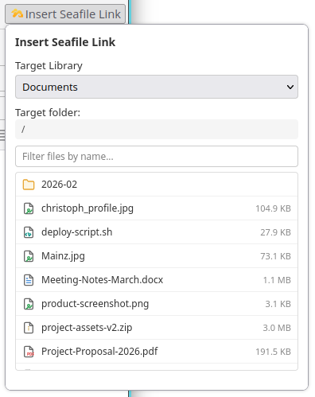
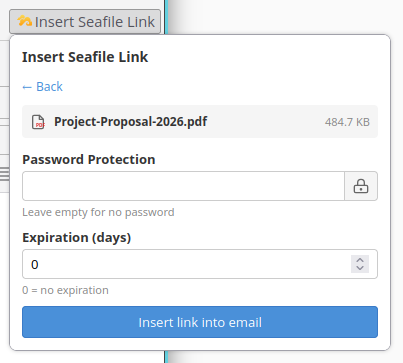
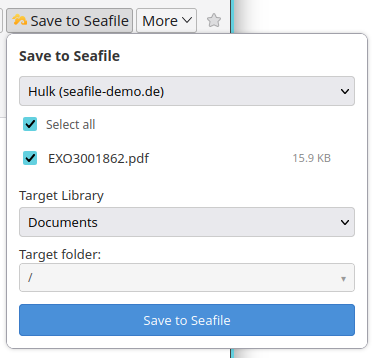
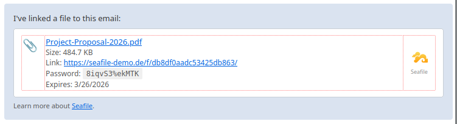
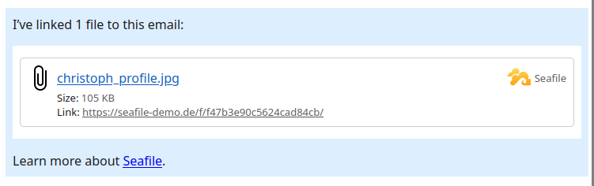
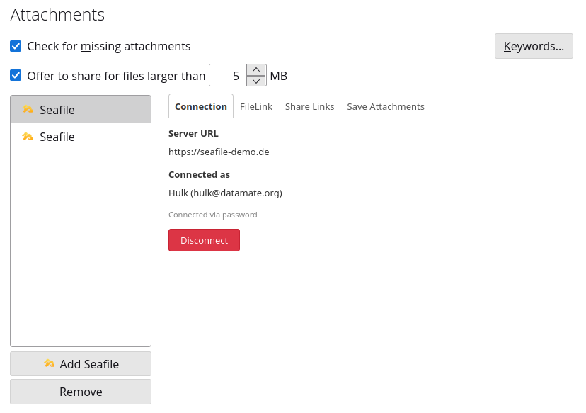
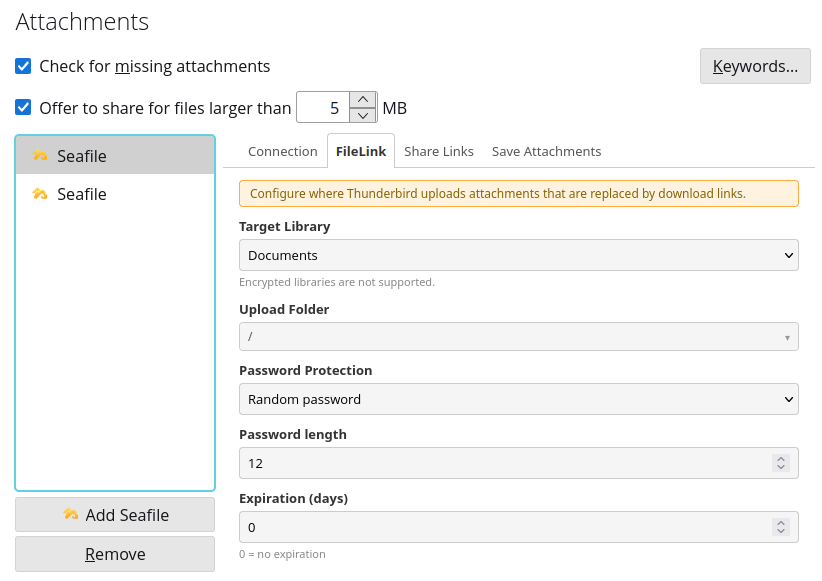
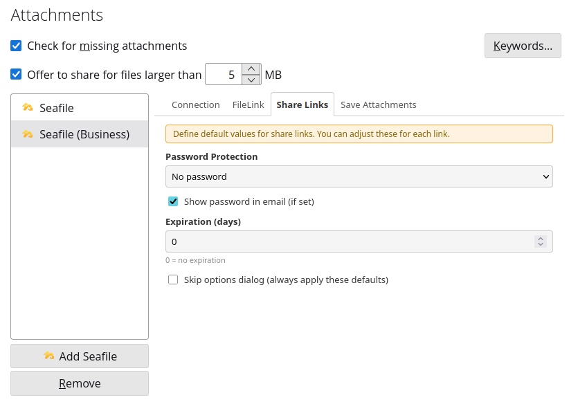
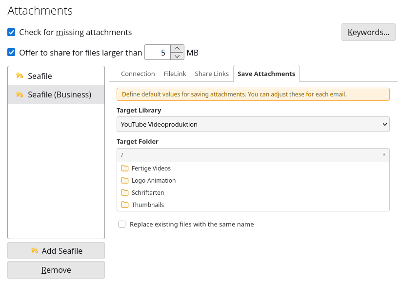
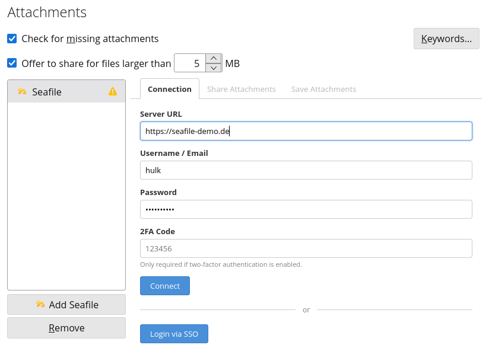

# Seafile for Thunderbird

A Thunderbird add-on that integrates [Seafile](https://www.seafile.com) as a CloudFile provider. Large email attachments are automatically uploaded to your Seafile server and replaced with download links. Received attachments can be saved directly to Seafile. Existing files on Seafile can be browsed and inserted as share links into emails.

Built by [datamate](https://datamate.org), the Seafile partner for Europe.

## Screenshots


*Browse your Seafile libraries, filter by name, and insert share links directly into emails.*


*Set password and expiration per link before inserting.*


*Save received email attachments directly to your Seafile server. Account selector for multi-account setups.*

<details>
<summary>More screenshots</summary>


*The inserted link matches the CloudFile template style with file name, size, password, and Seafile logo.*


*Attachments uploaded via Thunderbird's built-in FileLink also use the Seafile provider.*


*Connected state shows server, display name, and authentication method. Multiple accounts supported.*


*Configure target library, upload folder, and password protection (none, random, or custom) for FileLink uploads.*


*Set defaults for share links — password, expiration, and show-password-in-email option.*


*Set default library and folder for saving received attachments, with collapsible folder picker.*


*Connect with username/password (with optional 2FA) or via SSO.*

</details>

## Features

### Share attachments (outgoing)

- **CloudFile integration** — Thunderbird automatically offers to upload attachments exceeding the size threshold (default: 5 MB)
- **Share link creation** — each uploaded file gets a Seafile download link inserted into the email
- **Password protection** — optionally protect share links with a password
- **Link expiration** — set an automatic expiry (in days) for share links
- **File rename support** — renaming an attachment after upload renames the file on Seafile and updates the share link
- **Upload abort** — cancel in-progress uploads from Thunderbird's UI
- **Clean deletion** — removing a cloud attachment deletes both the share link and the file on Seafile
- **Reuse uploads** — previously uploaded files can be reinserted directly from the Filelink menu
- **Existing link handling** — if a share link already exists, it is replaced automatically
- **Password modes** — no password, random password (configurable length), or custom password

### Insert Seafile links (compose)

- **Browse & insert** — browse your Seafile libraries and folders directly in the compose window
- **File selection** — click a file to select it, then configure link options before inserting
- **File type icons** — color-coded SVG icons for common file types (PDF, images, spreadsheets, archives, audio, video, code, etc.)
- **Password & expiration** — set password and expiration per link, or use defaults from settings
- **Password generator** — generate secure random passwords with one click (cryptographically secure, configurable length)
- **Show password in email** — choose to display the password in the email or show a "sent separately" hint (configurable per link, default in settings)
- **File filter** — search/filter files by name when folders contain many entries
- **Existing link detection** — reuse existing share links or create a new one
- **Rich email template** — inserted links match the CloudFile template style (file name, size, link URL, Seafile logo)
- **Cursor position insert** — links are inserted at the cursor position without modifying existing email content

### Save attachments (incoming)

- **Save attachments to Seafile** — click the Seafile button in the message header to save received attachments
- **Library & folder selection** — choose target library and navigate folders with a collapsible folder picker
- **Batch saving** — select multiple attachments at once, with synced "Select all" checkbox
- **Per-file status** — visual SVG feedback for each file during upload
- **Duplicate handling** — configurable: rename automatically (default) or overwrite existing files

### Authentication

- **Username & password** — standard Seafile login
- **Two-factor authentication (2FA)** — optional TOTP code field for accounts with 2FA enabled
- **Single Sign-On (SSO)** — login via browser using SAML, OAuth, Keycloak, or any SSO method configured on the server
- **Display name** — shows user display name and contact email from Seafile account info
- **Connection status** — clearly shows server, username, and authentication method (SSO or password)
- **Disconnect** — one-click disconnect with automatic cleanup
- **HTTPS validation** — warns when connecting over HTTP to non-localhost servers

### Settings & UI

- **Multi-account support** — configure multiple Seafile accounts, switch between them in popups (last used is remembered)
- **Tabbed settings** — Connection, FileLink, Share Links, Save Attachments
- **Auto-save** — all configuration changes are saved immediately with visual feedback
- **Collapsible folder picker** — browse and select folders visually (click to expand, click outside to close)
- **Library refresh** — library list refreshes automatically when switching tabs
- **Encrypted library filtering** — encrypted libraries are excluded automatically
- **Error notifications** — system notifications when actions fail (e.g. unconfigured account)
- **Localization** — English, German, French, Chinese (Simplified), Spanish, Russian, Portuguese (BR)

## Requirements

- **Thunderbird** 128 or later
- **Seafile Server** 10.0 or later (Community Edition or Professional Edition)

## Installation

### From addons.thunderbird.net (recommended)

<!-- TODO: Add ATN link once published -->

### From .xpi file

Download the latest `.xpi` from the [Releases](https://github.com/datamate-rethink-it/seafile-thunderbird/releases) page and install via **Add-ons & Themes → gear icon → Install Add-on From File**.

### From source (development)

1. Clone this repository
2. Open Thunderbird → **Add-ons & Themes** (`Ctrl+Shift+A`)
3. Click the gear icon → **Debug Add-ons**
4. Click **Load Temporary Add-on...**
5. Select the `manifest.json` file

## Configuration

After installation, go to **Settings → Composition → Attachments** and click **Add Seafile**.

1. Enter your **Seafile server URL** (e.g. `https://cloud.seafile.com`). HTTPS is strongly recommended.
2. Log in using one of two methods:
   - **Username/password**: Enter credentials and optionally a **2FA code**, then click **Connect**
   - **SSO**: Click **Login via SSO** — a browser window opens for authentication. If SSO is not enabled on the server, a hint with the required server configuration is shown.
3. **FileLink tab**: Select target library and upload folder, configure password protection (none/random/custom) and link expiration
4. **Share Links tab**: Set defaults for share links when inserting Seafile links (password, expiration, show password in email)
5. **Save Attachments tab**: Select default library and folder for saving received attachments

All settings are saved automatically.

### SSO setup

To use SSO login, the Seafile server admin must enable client SSO in `seahub_settings.py`:

```python
CLIENT_SSO_VIA_LOCAL_BROWSER = True
```

This works with any SSO method configured on the server (SAML, OAuth, Keycloak, Shibboleth, etc.).

## Usage

### Sharing attachments

When composing an email, add an attachment as usual. If the file exceeds the size threshold, Thunderbird will offer to upload it via Seafile. You can also right-click any attachment and select **Convert to → Seafile**.

The recipient sees a download link in the email body with file name, size, and (if configured) password and expiration info.

### Inserting Seafile links

When composing an email, click the **Insert Seafile Link** button in the compose toolbar. Browse your Seafile libraries, select a file, optionally set password and expiration, and click **Insert link into email**. The link is inserted at the cursor position with a styled template showing file name, size, and download URL.

### Saving attachments

When viewing an email with attachments, click the **Save to Seafile** button in the message header toolbar. A popup lets you select which attachments to save, choose a library and folder, and upload them to Seafile.

## Known Limitations

- **Attachment reminder warning** — When inserting a Seafile link, Thunderbird may show a yellow "Found an attachment keyword" warning because it detects the file name in the email body. This is a Thunderbird feature that cannot be suppressed by extensions. You can dismiss it with the X button.
- **Folder picker and external clicks** — The collapsible folder picker in settings closes when clicking inside the settings area, but may not close when clicking on Thunderbird's surrounding UI (due to iframe boundaries).
- **No upload progress** — Thunderbird's CloudFile API does not provide a progress callback, so there is no upload progress bar (this is a [known Thunderbird limitation](https://bugzilla.mozilla.org/show_bug.cgi?id=1788498) since 2012).

## Building

To create an `.xpi` file for distribution:

```bash
zip -r seafile-thunderbird.xpi manifest.json background.js api/ management/ insert-link/ save-attachments/ icons/ _locales/ LICENSE PRIVACY.md
```

## Project Structure

```
├── manifest.json              # WebExtension manifest (Manifest V3)
├── background.js              # CloudFile event handlers + message router
├── api/
│   └── seafile.js             # Seafile API client
├── management/
│   ├── management.html        # Account configuration page (tabbed)
│   └── management.js          # Configuration logic + folder picker
├── insert-link/
│   ├── popup.html             # Insert Seafile link popup (compose)
│   └── popup.js               # File browser + link insertion logic
├── save-attachments/
│   ├── popup.html             # Save attachments popup
│   └── popup.js               # Popup logic (attachment list, folder nav)
├── icons/
│   ├── file-icons.js          # Shared SVG file type + status icons
│   └── *.png, *.svg           # Seafile logo icons
├── _locales/                  # Translations (en, de, fr, zh_CN, es, ru, pt_BR)
├── dev/
│   └── docker-compose.yml     # Local Seafile for development
├── PRIVACY.md                 # Privacy policy
└── LICENSE                    # Apache 2.0
```

## Privacy

This extension does not collect or share any data with third parties. All data is stored locally in your Thunderbird profile and communicated exclusively with your configured Seafile server. Your Seafile password is never stored — only the API token is persisted.

See [PRIVACY.md](PRIVACY.md) for the full privacy policy.

## Contributing

Contributions are welcome! Please open an issue to discuss your idea before submitting a pull request.

- Bug reports: [GitHub Issues](https://github.com/datamate-rethink-it/seafile-thunderbird/issues)
- Translation improvements: Edit the files in `_locales/` and submit a PR

## Development

A Docker Compose setup is included for local testing with Seafile:

```bash
cd dev
cp .env.example .env  # adjust credentials if needed
docker compose up -d
```

The local Seafile instance will be available at `http://127.0.0.1:8080`.

## Roadmap

- [ ] Publish on [addons.thunderbird.net](https://addons.thunderbird.net)
- [ ] Create new folders from within popups

## License

[Apache License 2.0](LICENSE)
